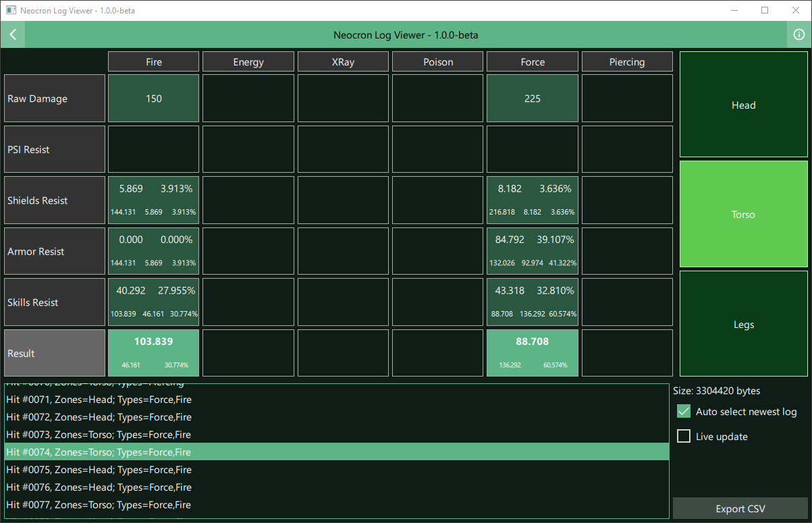

# Neocron Log Viewer
Parses Neocron's log files and displays it's information.

## Features
- Analyze __Character Log__ files (e.g.: `$NEOCRON/logs/<YourCharacterName>_00.log`)
  - Live update while game is running
  - Export in structured CSV for further investigation

## License
This program is released under license _GNU General Public License version 3_.