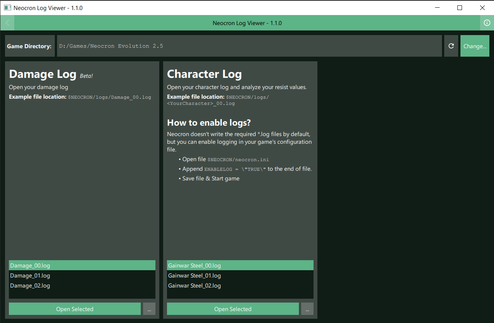
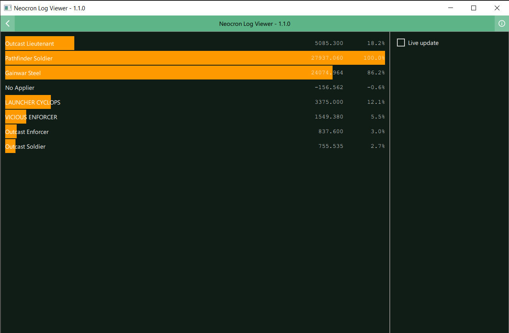

# Neocron Log Viewer
Parses Neocron's log files and displays it's information.



## Features
- Analyze __Character Log__ files (e.g.: `$NEOCRON/logs/<YourCharacterName>_00.log`)
  - Live update while game is running
  - Export in structured CSV for further investigation
- Analyze __Damage Log__ files (e.g.: `$NEOCRON/logs/Damage_00.log`)
  - Live update while game is running

## Download
[Download from here](https://drive.google.com/drive/folders/1KhpADdxU8OFcuKMqCyrBIOTBiFjE0UbK?usp=sharing)
the newest version.

## Upcoming Features & Ideas
- __Damage Log__
  - Implement session based online service to synchronize logs from other players within same session.

## License
This program is released under license _GNU General Public License version 3_.

## Screenshots

*Character Log Analysis*


*Damage Log Analysis*

## Developer Notes

### How to create Installer
Note: This only works in _Manuel's_ environment right now.

- Build project with release settings
- Run `deploy.bat` script

### File License Header
The following license notice should be the first in all source files.
```
Copyright 2021 Manuel Freiholz

This file is part of SteelsNeocronTool.

SteelsNeocronTool is free software: you can redistribute it and/or modify
it under the terms of the GNU General Public License as published by
the Free Software Foundation, either version 3 of the License, or
(at your option) any later version.

SteelsNeocronTool is distributed in the hope that it will be useful,
but WITHOUT ANY WARRANTY; without even the implied warranty of
MERCHANTABILITY or FITNESS FOR A PARTICULAR PURPOSE.  See the
GNU General Public License for more details.

You should have received a copy of the GNU General Public License
along with SteelsNeocronTool.  If not, see <https://www.gnu.org/licenses/>.
```